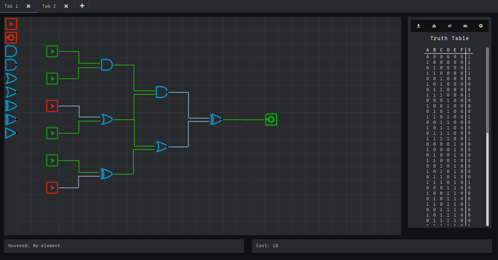

# Circuit Buddy

## Overview

A simple digital circuits toolbox that has an intuitive UI. Designed for students studying digital
circuits. Built by Jeffrey Xiao, Kevin Pei, Nick Bo, and Daniel Tong. Circuit Buddy was a top 30
finalist at PennApps XV Ad Astra.

Features:
 - Auto-updating truth table
 - Multiple tabs
 - Importing and exporting with json text or images
 - Circuit simplification with the Quine–McCluskey algorithm
 - Custom components

The backend is a simple flask server that handles the endpoints for openCV and the Quine-McCluskey
algorithm. The frontend is vanilla javascript built on [FabricJS](http://fabricjs.com/) and Vue for
most of the UI components.

Try it now: http://circuit-buddy.herokuapp.com/s/index.html

## Local Installation

To run it locally:
 * Clone the repository
 * Install openCV for python 2.7
 * Run the server with `python server.py`

## Local Development

To develop locally:
 * Clone the repository
 * Install dependencies with `node install`
 * Use webpack to watch the client-side js with `webpack --watch`
 * (Optional) Use development node server with `node server`

## Structure

Logic for the quine-mcluskey algorithm is handled in [qm.py](/qm.py) and openCV in
[openCv.py](/openCv.py). The structure and logic  for the user interface is located under
[components](/static/js/src/components/) as Vue components. The Vue components call library
functions located under [lib](/static/js/src/lib/).
